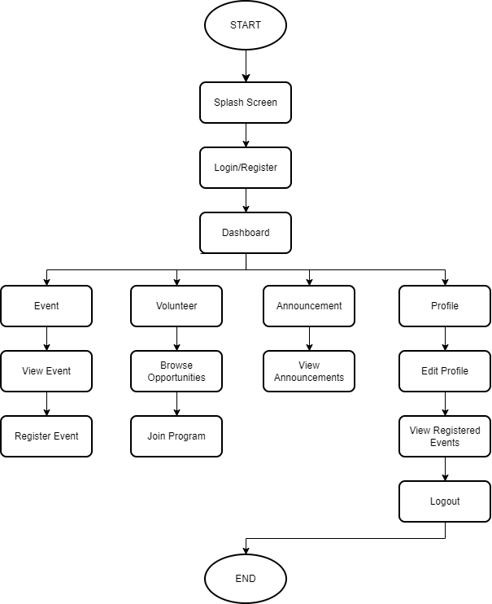

## GROUP 6 // INFO 4335 SEC 1 // SEM 2, 2025/2026

# BarakahHub

## 1. Introduction & Background

Mosques, Islamic centres, and community organizations frequently organize religious events, charity drives, volunteer programs, and educational activities. However, information regarding these activities is often shared through social media platforms and messaging applications, resulting in fragmented communication and low participation rates.

Community members may miss important announcements, while organizers face challenges managing registrations, volunteer participation, and event attendance efficiently.

### Problem Statement

There is currently no centralized mobile platform that allows Islamic organizations and community members to manage and participate in religious events and volunteer activities conveniently.

### Proposed Solution

BarakahHub is a Flutter-based hybrid mobile application that provides a centralized platform for:

* Event discovery
* Volunteer registration
* Community announcements
* User participation tracking

The application aims to strengthen community engagement while ensuring all content and functionalities comply with Islamic ethical values.

### Significance

The application benefits both organizers and community members by:

* Improving communication
* Increasing event participation
* Simplifying volunteer management
* Enhancing community engagement

---

## 4. Objectives

The objectives of BarakahHub are:

* To provide a centralized platform for Islamic community events and activities.
* To allow users to register and participate in events easily.
* To facilitate volunteer recruitment and management.
* To improve communication through announcements and notifications.
* To provide organizers with efficient event management tools.
* To encourage stronger community engagement through digital technology.

---

## 5. Target Users

### Primary Users

* **Community Members**
* Discover Islamic events
* Register for activities
* Join volunteer programs


* **Volunteers**
* Community service
* Charity programs
* Mosque activities


### Secondary Users

* **Event Organizers**
* Creating events
* Managing registrations
* Posting announcements


* **Mosque Committees**
* Community engagement
* Program coordination
* Volunteer management


---

## 6. Features & Functionalities

### Module 1: User Authentication

* **Features:** User Registration, User Login, Password Reset, Logout
* **Firebase Service:** Firebase Authentication

### Module 2: Event Management

* **Features:** View Upcoming Events, Search Events, Event Details, Event Registration, View Registered Events
* **Firebase Service:** Cloud Firestore

### Module 3: Volunteer Management

* **Features:** Browse Volunteer Opportunities, Volunteer Registration, Volunteer Status Tracking, Volunteer History
* **Firebase Service:** Cloud Firestore

### Module 4: Community Announcements

* **Features:** View Announcements, Announcement Details, Event Reminders
* **Firebase Service:** Cloud Firestore

### Module 5: User Profile

* **Features:** View Profile, Edit Profile, View Event Participation, View Volunteer History
* **Firebase Service:** Cloud Firestore

### Module 6: Push Notifications

* **Features:** New Event Notifications, Volunteer Activity Updates, Community Announcements
* **Firebase Service:** Firebase Cloud Messaging

---

## 7. UI Mock-Up

### Screen 1 – Splash Screen

* **Components:** App Logo, App Name, Loading Animation
* **Navigation:** Splash Screen $\rightarrow$ Login Page

### Screen 2 – Login Screen

* **Components:** Email TextField, Password TextField, Login Button, Register Button, Forgot Password Link
* **Navigation:** Login $\rightarrow$ Dashboard

### Screen 3 – Dashboard

* **Components:** Upcoming Events, Announcements, Volunteer Opportunities, Bottom Navigation Bar
* **Navigation:** * Dashboard $\rightarrow$ Events
* Dashboard $\rightarrow$ Volunteer
* Dashboard $\rightarrow$ Announcements
* Dashboard $\rightarrow$ Profile


### Screen 4 – Event Details

* **Components:** Event Banner, Event Description, Date & Time, Location, Register Button
* **Navigation:** Event Details $\rightarrow$ Registration Confirmation

### Screen 5 – Volunteer Opportunities

* **Components:** Volunteer List, Opportunity Details, Join Button
* **Navigation:** Volunteer Page $\rightarrow$ Join Volunteer Program

### Screen 6 – Announcements

* **Components:** Announcement Cards, Date Posted, Read More Button

### Screen 7 – User Profile

* **Components:** User Information, Registered Events, Volunteer History, Logout Button

---

## 8. Architecture / Technical Design

* **Development Framework:** Flutter SDK
* **Programming Language:** Dart
* **Backend Services:** Firebase (Authentication, Cloud Firestore, Firebase Cloud Messaging)
* **State Management:** Provider
* *Reason:* Easy implementation, lightweight, suitable for medium-sized applications, and highly recommended for student projects.


### Project Structure

```text
lib/
├── models/
├── services/
├── providers/
├── screens/
│   ├── auth/
│   ├── dashboard/
│   ├── events/
│   ├── volunteers/
│   ├── announcements/
│   └── profile/
├── widgets/
├── routes/
└── main.dart

```

---

## 9. Data Model

### Collection: `users`

| Field | Type |
| --- | --- |
| `userId` | String |
| `name` | String |
| `email` | String |
| `phone` | String |
| `role` | String |

### Collection: `events`

| Field | Type |
| --- | --- |
| `eventId` | String |
| `title` | String |
| `description` | String |
| `date` | Timestamp |
| `location` | String |
| `imageUrl` | String |

### Collection: `volunteers`

| Field | Type |
| --- | --- |
| `volunteerId` | String |
| `userId` | String |
| `eventId` | String |
| `status` | String |

### Collection: `announcements`

| Field | Type |
| --- | --- |
| `announcementId` | String |
| `title` | String |
| `content` | String |
| `date` | Timestamp |

---

## 10. Flowchart



---

## 11. Expected Technologies & Packages

### Frontend

* Flutter
* Dart

### Backend

* Firebase Authentication
* Cloud Firestore
* Firebase Cloud Messaging

### External Packages

* `provider`
* `firebase_auth`
* `cloud_firestore`
* `firebase_messaging`
* `image_picker`
* `intl`

---

## 12. References

* [Flutter Documentation](https://docs.flutter.dev)
* [Firebase Documentation](https://firebase.google.com/docs)
* [Material Design 3](https://m3.material.io)
* [Provider Package](https://pub.dev/packages/provider)
* [Firebase Authentication Package](https://pub.dev/packages/firebase_auth)
* [Cloud Firestore Package](https://pub.dev/packages/cloud_firestore)
* [Firebase Messaging Package](https://pub.dev/packages/firebase_messaging)
* [FlutterFire Documentation](https://firebase.flutter.dev)

---

## Expected Outcomes

Upon completion, BarakahHub will provide a functional mobile platform that enables Islamic organizations and community members to manage events, volunteer activities, and announcements efficiently while strengthening community engagement through digital technology.
